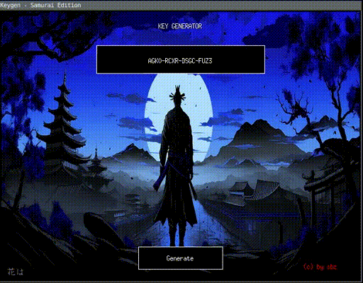

# Keygen - X11 Key Generator

A simple graphical key generator application using the X11 library like the good
old keygen from the 1990s era but for UNIX.

FreeBSD and Linux are supported.
- Background sound is using ALSA on Linux
- Background sound is using Open Sound System (OSS) on FreeBSD

"Because I'm a huge fan of Samurai" -- **Hana wa sakuragi, hito wa bushi**

And yes, Keygen are totally useless now because we are free and use Free Software!

## Requirements

- C compiler (GCC or clang)
- X11 development libraries
- Alsa library libasound
- Mpeg library libmpg123
- Jpeg library libjpeg
- Xft library libxft for font rendering

To render Japanese Kanji you need to install KanjiStrokeOrders font from https://www.nihilist.org.uk

## Building

```bash
make
```

## Usage

```bash
./keygen
```

## Features

- Generates random 16-character alphanumeric keys
- Keys are formatted with dashes every 4 characters (e.g., `ABCD-1234-EFGH-5678`)
- Click the "Generate" button to create a new key
- Press `Q` or `Escape` to quit
- Press `S` to change the background
- Press `M` to mute the sound
- Press `N` to change the mp3 music played

## How it works

The application creates an X11 window with:
- A title at the top
- The generated key displayed in the center
- A "Generate" button at the bottom
- It display the image in the img/ folder as background
- It plays a sound in the background as well

Each time you click the button, a new random key is generated using `rand()` seeded with the current time.

## Visual

Here what its looks like, but the experience is way better with the 8-bits background sound



## FAQ

The 8-bits chiptune background music are royalty free and are from the website https://www.fesliyanstudios.com
